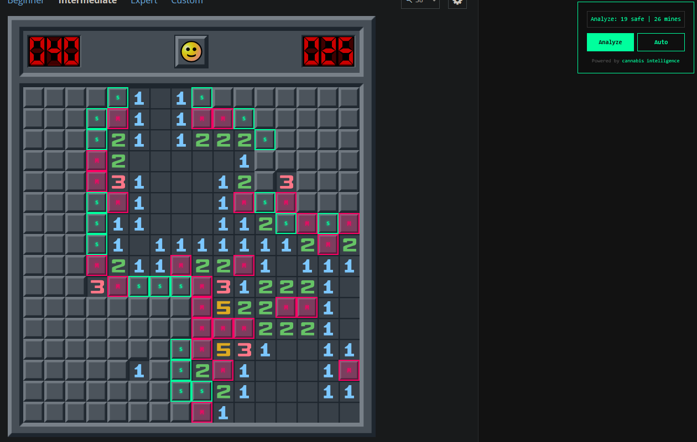

# minesweeper

tampermonkey script for [minesweeper.online](https://minesweeper.online) — auto-solves any board.

  

## install

1. install [tampermonkey](https://www.tampermonkey.net/)
2. open `solver.js` and click **Raw**
3. tampermonkey will prompt to install the script
4. go to [minesweeper.online](https://minesweeper.online) and press **New Game**

the script solves the board automatically.

## how it works

reads the board state, calculates safe cells via constraint propagation, and clicks them all.

---

powered by <a href="https://cannabis-intelligence.github.io">cannabis intelligence</a>

